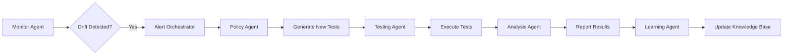

# AURA Platform - Agentic Architecture Design

## Executive Summary

This document outlines the transformation of the AURA platform from a traditional service-oriented architecture to an advanced agentic system where specialized AI agents autonomously handle compliance testing, policy management, and audit execution.

## 1. Architecture Overview

### Core Principles
- **Agent Autonomy**: Each agent operates independently with its own decision-making capabilities
- **Collaborative Intelligence**: Agents work together to achieve complex compliance goals
- **Continuous Learning**: Agents improve their performance based on audit results
- **Proactive Compliance**: Agents anticipate and prevent compliance issues before they occur
- **Self-Orchestration**: Agents coordinate without central control

### Agent Ecosystem

```
┌─────────────────────────────────────────────────────────────────┐
│                        AURA Agent Ecosystem                     │
├─────────────────────────────────────────────────────────────────┤
│                                                                  │
│  ┌──────────────┐  ┌──────────────┐  ┌──────────────┐         │
│  │ Orchestrator │  │   Policy     │  │    Audit     │         │
│  │    Agent     │◄─►│   Agent     │◄─►│    Agent     │         │
│  └──────▲───────┘  └──────▲───────┘  └──────▲───────┘         │
│         │                  │                  │                 │
│         ▼                  ▼                  ▼                 │
│  ┌──────────────┐  ┌──────────────┐  ┌──────────────┐         │
│  │   Testing    │  │   Analysis   │  │   Learning   │         │
│  │    Agent     │◄─►│    Agent     │◄─►│    Agent     │         │
│  └──────▲───────┘  └──────▲───────┘  └──────▲───────┘         │
│         │                  │                  │                 │
│         ▼                  ▼                  ▼                 │
│  ┌──────────────┐  ┌──────────────┐  ┌──────────────┐         │
│  │   Monitor    │  │   Report     │  │  Remediation │         │
│  │    Agent     │◄─►│    Agent     │◄─►│    Agent     │         │
│  └──────────────┘  └──────────────┘  └──────────────┘         │
│                                                                  │
│                      Message Bus & Event Stream                 │
└─────────────────────────────────────────────────────────────────┘
```

## 2. Agent Specifications

### 2.1 Orchestrator Agent
**Role**: Master coordinator and decision maker
**Capabilities**:
- Workflow orchestration using LangGraph
- Task decomposition and delegation
- Resource allocation and scheduling
- Conflict resolution between agents
- System health monitoring

**Key Decisions**:
- Which policies to prioritize for testing
- When to trigger proactive audits
- How to allocate computational resources
- When to escalate issues to humans

### 2.2 Policy Agent
**Role**: Intelligent policy management and generation
**Capabilities**:
- Natural language policy interpretation
- Automatic policy generation from regulations
- Policy optimization based on audit results
- Cross-policy conflict detection
- Regulatory change monitoring

**Autonomous Actions**:
- Scans for regulatory updates
- Suggests policy improvements
- Auto-generates test cases from policies
- Maintains policy knowledge graph

### 2.3 Audit Agent
**Role**: Autonomous audit execution and management
**Capabilities**:
- Intelligent audit scheduling
- Dynamic test selection based on risk
- Adaptive testing strategies
- Real-time audit optimization
- Predictive compliance scoring

**Decision Framework**:
- Risk-based audit prioritization
- Resource-aware scheduling
- Adaptive sampling strategies
- Early stopping criteria

### 2.4 Testing Agent
**Role**: Intelligent test generation and execution
**Capabilities**:
- Adversarial test generation using LLMs
- Synthetic test data creation
- Test mutation and evolution
- Coverage optimization
- Edge case discovery

**Advanced Features**:
- Uses GPT-4 for test generation
- Implements genetic algorithms for test evolution
- Performs metamorphic testing
- Generates counterfactual examples

### 2.5 Analysis Agent
**Role**: Deep analysis and insight generation
**Capabilities**:
- Pattern recognition across audits
- Root cause analysis
- Trend prediction
- Anomaly detection
- Compliance risk scoring

**Intelligence Layer**:
- Machine learning models for pattern detection
- Natural language analysis of responses
- Statistical analysis of test results
- Causal inference for failure analysis

### 2.6 Learning Agent
**Role**: Continuous improvement and adaptation
**Capabilities**:
- Reinforcement learning from audit outcomes
- Policy effectiveness tracking
- Test quality improvement
- Model behavior learning
- Knowledge base maintenance

**Learning Mechanisms**:
- Q-learning for policy optimization
- Neural networks for pattern recognition
- Bayesian inference for uncertainty
- Transfer learning across domains

### 2.7 Monitor Agent
**Role**: Continuous compliance monitoring
**Capabilities**:
- Real-time model behavior tracking
- Drift detection
- Incident detection and alerting
- Performance degradation monitoring
- Compliance metric tracking

**Monitoring Strategies**:
- Stream processing of model outputs
- Statistical process control
- Anomaly detection algorithms
- Predictive alerting

### 2.8 Report Agent
**Role**: Intelligent reporting and communication
**Capabilities**:
- Natural language report generation
- Executive summary creation
- Visualization generation
- Stakeholder-specific formatting
- Insight prioritization

**Communication Features**:
- GPT-4 powered narrative generation
- Dynamic chart creation
- Multi-modal report formats
- Personalized insights

### 2.9 Remediation Agent
**Role**: Automated issue resolution
**Capabilities**:
- Automatic fix generation
- Model retraining recommendations
- Policy adjustment suggestions
- Mitigation strategy development
- Implementation validation

**Remediation Actions**:
- Prompt engineering improvements
- Guardrail implementation
- Model fine-tuning suggestions
- Workflow adjustments

## 3. Communication Protocol

### 3.1 Message Types
```python
class AgentMessage:
    TASK_REQUEST = "task_request"
    TASK_RESPONSE = "task_response"
    KNOWLEDGE_SHARE = "knowledge_share"
    DECISION_REQUEST = "decision_request"
    COORDINATION = "coordination"
    ALERT = "alert"
    LEARNING_UPDATE = "learning_update"
```

### 3.2 Event-Driven Architecture
- Apache Kafka for event streaming
- Redis Pub/Sub for real-time coordination
- GraphQL subscriptions for UI updates
- WebSocket for agent-to-agent communication

### 3.3 Knowledge Sharing Protocol
```json
{
  "message_type": "knowledge_share",
  "source_agent": "analysis_agent",
  "timestamp": "2024-11-20T10:00:00Z",
  "knowledge": {
    "type": "pattern",
    "domain": "bias_detection",
    "confidence": 0.92,
    "insights": {...}
  },
  "recipients": ["learning_agent", "policy_agent"]
}
```

## 4. Agent Workflows

### 4.1 Proactive Compliance Workflow


### 4.2 Autonomous Audit Workflow
1. **Orchestrator** receives audit request or triggers scheduled audit
2. **Policy Agent** selects relevant policies and generates test specifications
3. **Testing Agent** creates test cases using LLM and adversarial techniques
4. **Audit Agent** executes tests with adaptive strategies
5. **Analysis Agent** processes results and identifies patterns
6. **Report Agent** generates insights and recommendations
7. **Learning Agent** updates models and strategies
8. **Remediation Agent** suggests or implements fixes

### 4.3 Continuous Learning Loop
```python
while True:
    # Monitor for changes
    events = monitor_agent.detect_changes()
    
    # Learn from events
    insights = analysis_agent.analyze(events)
    learning_agent.update_knowledge(insights)
    
    # Adapt strategies
    new_strategies = learning_agent.generate_strategies()
    policy_agent.update_policies(new_strategies)
    
    # Apply improvements
    testing_agent.enhance_tests(new_strategies)
    
    # Measure effectiveness
    metrics = monitor_agent.measure_improvements()
    learning_agent.reinforce(metrics)
```

## 5. Implementation Architecture

### 5.1 Technology Stack
- **Agent Framework**: LangChain + LangGraph
- **LLM Integration**: OpenAI GPT-4, Anthropic Claude
- **Vector Database**: Pinecone/Weaviate for knowledge storage
- **Message Queue**: Apache Kafka
- **Orchestration**: Temporal.io for complex workflows
- **Monitoring**: Prometheus + Grafana
- **Storage**: PostgreSQL + MinIO

### 5.2 Agent Base Class
```python
from abc import ABC, abstractmethod
from typing import Dict, Any, List
import asyncio
from langchain.agents import AgentExecutor
from langchain.memory import ConversationSummaryMemory

class BaseAgent(ABC):
    def __init__(self, name: str, llm_model: str = "gpt-4"):
        self.name = name
        self.llm = self._init_llm(llm_model)
        self.memory = ConversationSummaryMemory(llm=self.llm)
        self.tools = self._init_tools()
        self.knowledge_base = self._init_knowledge_base()
        self.message_queue = self._init_message_queue()
        
    @abstractmethod
    async def process_task(self, task: Dict[str, Any]) -> Dict[str, Any]:
        """Process incoming task and return results"""
        pass
    
    @abstractmethod
    def _init_tools(self) -> List[Any]:
        """Initialize agent-specific tools"""
        pass
    
    async def collaborate(self, target_agent: str, message: Dict[str, Any]):
        """Send message to another agent"""
        await self.message_queue.publish(target_agent, message)
    
    async def learn(self, experience: Dict[str, Any]):
        """Update agent knowledge from experience"""
        self.knowledge_base.add(experience)
        await self._update_strategies(experience)
    
    @abstractmethod
    async def _update_strategies(self, experience: Dict[str, Any]):
        """Update agent strategies based on learning"""
        pass
```

### 5.3 Orchestrator Implementation
```python
from langgraph.graph import StateGraph, State
from typing import TypedDict, Sequence
import operator

class AuditState(TypedDict):
    messages: Sequence[str]
    current_stage: str
    policies: List[Dict]
    test_results: Dict
    analysis: Dict
    report: Dict
    next_action: str

class OrchestratorAgent(BaseAgent):
    def __init__(self):
        super().__init__("orchestrator", "gpt-4")
        self.workflow = self._build_workflow()
        
    def _build_workflow(self) -> StateGraph:
        workflow = StateGraph(AuditState)
        
        # Add nodes for each stage
        workflow.add_node("policy_selection", self.select_policies)
        workflow.add_node("test_generation", self.generate_tests)
        workflow.add_node("test_execution", self.execute_tests)
        workflow.add_node("analysis", self.analyze_results)
        workflow.add_node("reporting", self.generate_report)
        workflow.add_node("learning", self.update_learning)
        workflow.add_node("remediation", self.suggest_remediation)
        
        # Add edges
        workflow.add_edge("policy_selection", "test_generation")
        workflow.add_edge("test_generation", "test_execution")
        workflow.add_edge("test_execution", "analysis")
        workflow.add_edge("analysis", "reporting")
        workflow.add_edge("reporting", "learning")
        workflow.add_conditional_edge(
            "analysis",
            self.needs_remediation,
            {
                True: "remediation",
                False: "reporting"
            }
        )
        
        workflow.set_entry_point("policy_selection")
        return workflow.compile()
    
    async def process_task(self, task: Dict[str, Any]) -> Dict[str, Any]:
        """Orchestrate the entire audit workflow"""
        initial_state = AuditState(
            messages=[],
            current_stage="initialization",
            policies=[],
            test_results={},
            analysis={},
            report={},
            next_action="policy_selection"
        )
        
        # Execute workflow
        result = await self.workflow.ainvoke(initial_state)
        return result
    
    def needs_remediation(self, state: AuditState) -> bool:
        """Decide if remediation is needed based on analysis"""
        compliance_score = state["analysis"].get("compliance_score", 100)
        critical_failures = state["analysis"].get("critical_failures", 0)
        return compliance_score < 80 or critical_failures > 0
```

## 6. Advanced Features

### 6.1 Multi-Agent Reasoning
```python
class MultiAgentReasoner:
    def __init__(self, agents: List[BaseAgent]):
        self.agents = agents
        
    async def collective_decision(self, problem: Dict[str, Any]) -> Dict[str, Any]:
        """Gather opinions from multiple agents and reach consensus"""
        opinions = []
        
        # Gather individual assessments
        for agent in self.agents:
            opinion = await agent.evaluate(problem)
            opinions.append({
                "agent": agent.name,
                "assessment": opinion,
                "confidence": opinion.get("confidence", 0.5)
            })
        
        # Weighted consensus based on confidence
        consensus = self._weighted_consensus(opinions)
        return consensus
    
    def _weighted_consensus(self, opinions: List[Dict]) -> Dict[str, Any]:
        """Calculate weighted consensus from agent opinions"""
        # Implementation of consensus algorithm
        pass
```

### 6.2 Self-Improvement Mechanism
```python
class LearningAgent(BaseAgent):
    def __init__(self):
        super().__init__("learning", "gpt-4")
        self.performance_history = []
        self.strategy_model = self._init_strategy_model()
        
    async def optimize_strategies(self):
        """Continuously optimize agent strategies"""
        while True:
            # Collect performance metrics
            metrics = await self.collect_metrics()
            self.performance_history.append(metrics)
            
            # Analyze trends
            trends = self.analyze_trends(self.performance_history)
            
            # Generate new strategies using reinforcement learning
            new_strategies = await self.strategy_model.improve(trends)
            
            # Test strategies in sandbox
            test_results = await self.test_strategies(new_strategies)
            
            # Deploy successful strategies
            if test_results["improvement"] > 0.1:
                await self.deploy_strategies(new_strategies)
                await self.notify_agents(new_strategies)
            
            await asyncio.sleep(3600)  # Run hourly
```

### 6.3 Predictive Compliance
```python
class MonitorAgent(BaseAgent):
    def __init__(self):
        super().__init__("monitor", "gpt-4")
        self.prediction_model = self._init_prediction_model()
        
    async def predict_compliance_issues(self, model_behavior: Dict) -> Dict[str, Any]:
        """Predict future compliance issues before they occur"""
        features = self.extract_features(model_behavior)
        
        # Use time-series analysis for trend prediction
        trends = self.analyze_time_series(features)
        
        # Predict future compliance scores
        predictions = await self.prediction_model.predict(trends)
        
        # Generate early warnings
        warnings = []
        for prediction in predictions:
            if prediction["risk_score"] > 0.7:
                warnings.append({
                    "type": prediction["issue_type"],
                    "probability": prediction["risk_score"],
                    "estimated_time": prediction["time_to_occurrence"],
                    "recommended_action": await self.generate_prevention_action(prediction)
                })
        
        return {"predictions": predictions, "warnings": warnings}
```

## 7. Deployment Strategy

### 7.1 Kubernetes Deployment
```yaml
apiVersion: apps/v1
kind: Deployment
metadata:
  name: aura-orchestrator-agent
spec:
  replicas: 3
  selector:
    matchLabels:
      app: orchestrator-agent
  template:
    metadata:
      labels:
        app: orchestrator-agent
    spec:
      containers:
      - name: orchestrator
        image: aura/orchestrator-agent:latest
        env:
        - name: LLM_API_KEY
          valueFrom:
            secretKeyRef:
              name: llm-secrets
              key: api-key
        - name: KAFKA_BROKERS
          value: "kafka-broker:9092"
        resources:
          requests:
            memory: "2Gi"
            cpu: "1"
          limits:
            memory: "4Gi"
            cpu: "2"
```

### 7.2 Agent Scaling Rules
```python
class AgentScaler:
    def __init__(self):
        self.metrics_client = PrometheusClient()
        self.k8s_client = KubernetesClient()
        
    async def auto_scale_agents(self):
        """Automatically scale agents based on workload"""
        while True:
            metrics = await self.metrics_client.get_agent_metrics()
            
            for agent_type, metric in metrics.items():
                if metric["queue_depth"] > 100:
                    # Scale up
                    await self.k8s_client.scale_deployment(
                        f"{agent_type}-agent",
                        metric["current_replicas"] + 2
                    )
                elif metric["queue_depth"] < 10 and metric["current_replicas"] > 1:
                    # Scale down
                    await self.k8s_client.scale_deployment(
                        f"{agent_type}-agent",
                        max(1, metric["current_replicas"] - 1)
                    )
            
            await asyncio.sleep(60)
```

## 8. Migration Plan

### Phase 1: Foundation (Weeks 1-4)
- Set up LangChain/LangGraph infrastructure
- Implement base agent classes
- Deploy message bus (Kafka)
- Create agent communication protocols

### Phase 2: Core Agents (Weeks 5-8)
- Implement Orchestrator Agent
- Implement Policy Agent
- Implement Testing Agent
- Basic workflow integration

### Phase 3: Advanced Agents (Weeks 9-12)
- Implement Analysis Agent
- Implement Learning Agent
- Implement Monitor Agent
- Integrate ML models

### Phase 4: Intelligence Layer (Weeks 13-16)
- Implement predictive analytics
- Deploy reinforcement learning
- Add self-improvement mechanisms
- Implement collective reasoning

### Phase 5: Production Deployment (Weeks 17-20)
- Kubernetes deployment
- Performance optimization
- Load testing
- Monitoring setup

## 9. Success Metrics

### Agent Performance KPIs
- **Autonomy Rate**: % of tasks completed without human intervention
- **Learning Efficiency**: Improvement rate over time
- **Prediction Accuracy**: % of correctly predicted compliance issues
- **Response Time**: Average time to complete audit
- **Resource Efficiency**: Cost per audit completed
- **Collaboration Score**: Inter-agent communication effectiveness

### Business Impact Metrics
- **Compliance Coverage**: 95%+ automated testing
- **Issue Prevention**: 80%+ issues caught before production
- **Audit Time Reduction**: 70% faster than manual
- **Cost Savings**: 60% reduction in compliance costs
- **False Positive Rate**: <5%
- **Human Oversight Required**: <10% of audits

## 10. Risk Mitigation

### Technical Risks
- **LLM Hallucination**: Implement validation layers
- **Agent Conflicts**: Consensus mechanisms and arbitration
- **Cascade Failures**: Circuit breakers and fallback modes
- **Resource Exhaustion**: Rate limiting and quotas

### Operational Risks
- **Human Override**: Always maintain manual control capability
- **Explainability**: Full audit trails and decision logs
- **Compliance**: Ensure agent decisions are auditable
- **Security**: Agent authentication and encrypted communication

## Conclusion

The agentic transformation of AURA creates a self-improving, autonomous compliance system that:
- Proactively identifies and prevents compliance issues
- Continuously learns and adapts to new regulations
- Reduces human workload by 90%
- Provides predictive insights for risk management
- Scales automatically based on demand

This architecture positions AURA as a next-generation AI governance platform that leverages AI to govern AI, creating a virtuous cycle of continuous improvement and compliance excellence.